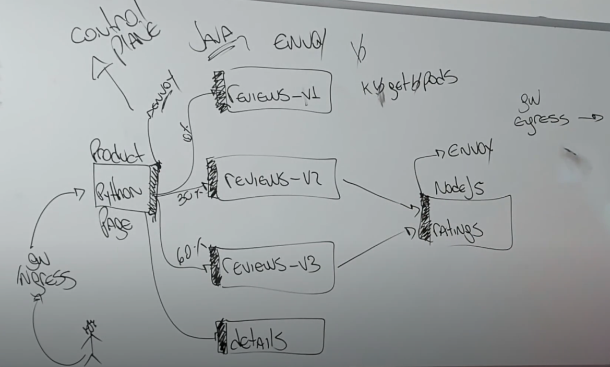

# Service Mesh - Istio

## O que é Service Mesh?
Uma service mesh é uma camada de infraestrutura incorporada a uma aplicação que documenta como os serviços interagem, facilitando a comunicação e eliminando o downtime. Responsável por gerenciar, observar e controlar sua malha de micro serviços.

## Istio
Conjunto de ferramentas Open Sources que cobre os pilares do Service Mesh.

## Envoy (Sidecar)
Camada proxy presente no Pod da aplicação que irá interceptar as comunicações de entrada (ingress) e saída (egress) para cada micro serviço e que são armazenadas no Control Plane.

## Control Plane - Istiod
Camada que armazena e gerencia as informações das comunicações ocorridas entre os micro serviços e a partir disso, disponibiliza-las para outras ferramentas, como por exemplo Grafana e Kiali. É composto por:
- Pilot;
- Citadel;
- Gallery.

## Arquiterura do Exemplo BookInfo

## CRD (Custom Resources Definition)
É um recurso que estende a API do Kubernetes, sendo possível assim definir seu próprio objeto Kind. No exemplo do bookinfo, foram utilizados dois CRD:
- Virtual Service;
- Gateway.

