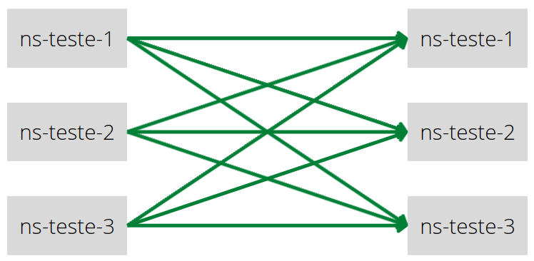
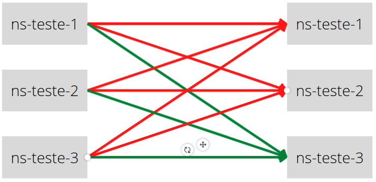
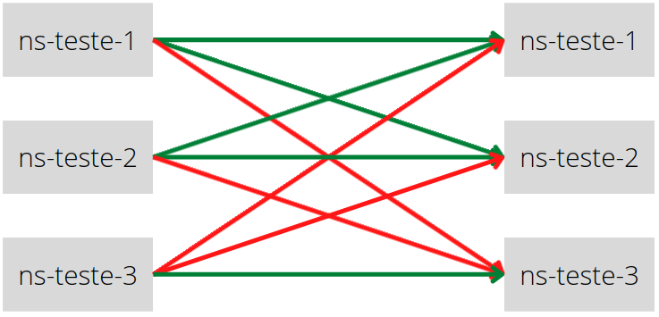
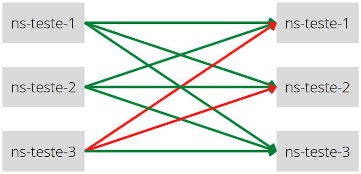

# Day 03 - Políticas e Segurança

## Políticas e Segurança
Ambiente usado no exemplo:
- Criação de 3 namespaces
```
kubectl create ns ns-teste-1
kubectl create ns ns-teste-2
kubectl create ns ns-teste-3
```
- Aplicar apenas em 2 namespaces as labels para que os sidecars (envoys)
```
kubectl label namespace ns-teste-1 istio-injection=enabled
kubectl label namespace ns-teste-2 istio-injection=enabled
```
- Inicializa o exemplo HTTPBIN nas 3 namespaces
```
kubectl apply -f istio-1.14.0/samples/httpbin/httpbin.yaml -n ns-teste-1
kubectl apply -f istio-1.14.0/samples/httpbin/httpbin.yaml -n ns-teste-2
kubectl apply -f istio-1.14.0/samples/httpbin/httpbin.yaml -n ns-teste-3
```
- Inicializa o exemplo SLEEP nas 3 namespaces
```
kubectl apply -f istio-1.14.0/samples/sleep/sleep.yaml -n ns-teste-1
kubectl apply -f istio-1.14.0/samples/sleep/sleep.yaml -n ns-teste-2
kubectl apply -f istio-1.14.0/samples/sleep/sleep.yaml -n ns-teste-3
```
- Realiza um teste de conexão via cURL entre o SLEEP e o HTTPBIN de namespaces diferentes, para que traga a variável *http_code*
```
kubectl exec -ti -n ns-teste-2 sleep-698cfc4445-tvgpx -- curl http://httpbin.ns-teste-1:8000/ip -s -o /dev/null -w "%{http_code}\n"
```


- Verifica as políticas atuais
```
kubectl get policies.authentication.istio.io --all-namespaces
kubectl get meshpolicies.authentication.istio.io
```
- Executa o arquivo Meshpolicy
```
kubectl apply -f day-03/meshpolicy.yaml
```
- Uma de minhas tentativas em fazer funcionar o MeshPolicy
```
istioctl manifest apply --set profile=demo \    
  --set values.global.mtls.auto=true --force \
  --set values.global.mtls.enabled=false --force
```
> Se tivesse dado certo o exemplo, a comunicação ocorreria com sucesso apenas nos casos abaixo em verde.


> Necessário criar um Destination Rule para a comunicação Mutual TLS ocorra entre as aplicações com sidecars(*destination-rule-meshpolicy.yaml*).



> Para corrigir a comunicação com a aplicação que não possui sidecar foi necessário incluir outro Destination Rule (*destination-rule-meshpolicy-fix.yaml*)



## RBAC - Role-Based Access Control
Fornece controle de acesso a nível de namespace, serviço ou método.

> Exemplo de configuração de RBAC baseado em namespace usando o Bookinfo.
- Verifica se o Mutual TLS está ativado para a namespace default
```
kubectl apply -f day-03/meshpolicy.yaml
```
- Implementa o arquivo de configuração RBAC (cluster-rbac-config.yaml)
```
kubectl apply -f day-03/cluster-rbac-config.yaml
```
- Executa o ServiceRole com o ServiceRoleBinding (namespace-policy.yaml)
```
kubectl apply -f day-03/namespace-policy.yaml
```

> Exemplo de configuração de RBAC baseado em serviços usando o Bookinfo.
- Executa o ServiceRole com o ServiceRoleBinding para o Product Page (productpage-policy.yaml). Define que o serviço Product Page pode realizar requisições do tipo GET na namespace Default
```
kubectl apply -f day-03/roductpage-policy.yaml
```
- Executa o ServiceRole com o ServiceRoleBinding para o Details (details-reviews-policy.yaml). Libera regra de acesso para o serviço Product Page acessar o serviço de Details.
```
kubectl apply -f day-03/details-reviews-policy.yaml
```
- Executa o ServiceRole com o ServiceRoleBinding para o Ratings (ratings-policy.yaml). Libera regra de acesso para o serviço Details acessar o serviço de Ratings.
```
kubectl apply -f day-03/ratings-policy.yaml
```